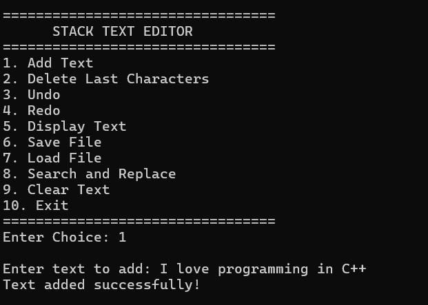
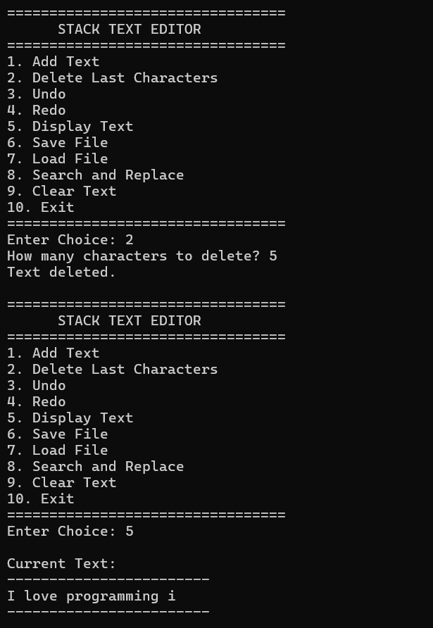
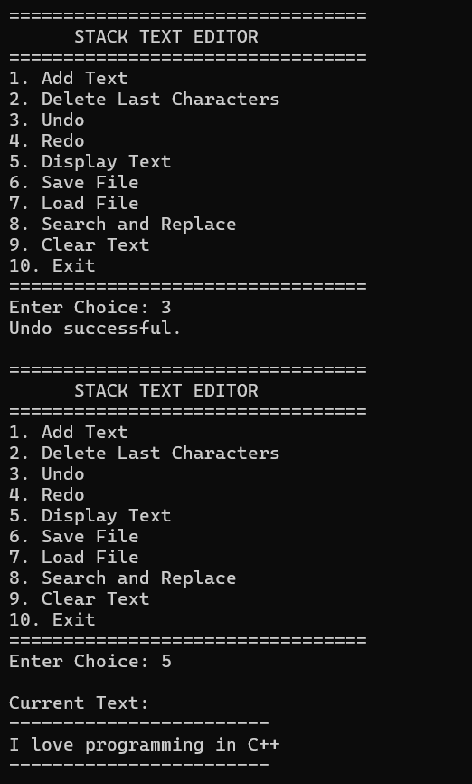
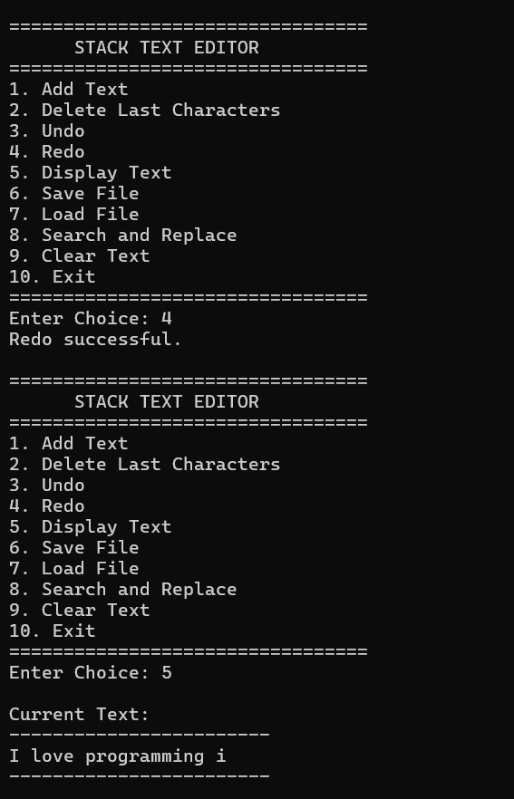
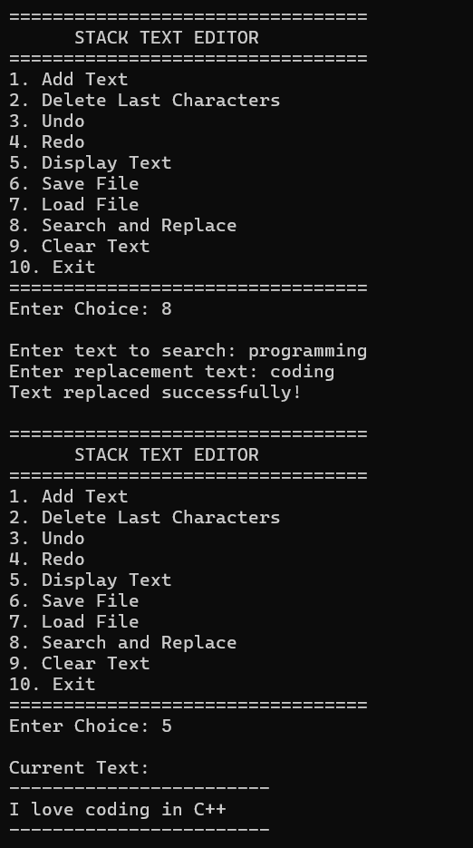

# Stack-Based Command-Line Text Editor in C++

A console-based text editor built in C++ as part of my Data Structures and Algorithms coursework. This project demonstrates the practical implementation of **stacks** by providing **undo** and **redo** functionality, along with various text editing and file management features.

## Features

* Add text to the editor
* Delete the last N characters
* Undo previous operations
* Redo undone operations
* Display the current text
* Save text to a file
* Load text from a file
* Search and replace text
* Clear all text
* Interactive menu-driven interface

## Data Structures Used

### Stack (LIFO)

This project uses two stacks to implement the undo and redo functionality:

* **Undo Stack** – stores previous states of the text before every modification
* **Redo Stack** – stores undone states to allow redo operations

This demonstrates the practical application of the **Last-In-First-Out (LIFO)** principle.

## Concepts Used

* Stack Data Structure
* STL `stack`
* Functions
* Strings
* File Handling (`fstream`)
* Search and Replace Operations
* Menu-Driven Programming
* Dynamic State Management

## How Undo/Redo Works

1. Before every modification, the current text is pushed onto the **Undo Stack**.
2. When **Undo** is performed:

   * The current text is pushed onto the **Redo Stack**.
   * The previous state is restored from the **Undo Stack**.
3. When **Redo** is performed:

   * The current text is pushed back onto the **Undo Stack**.
   * The last undone state is restored from the **Redo Stack**.

## What I Learned

* Practical implementation of stacks in C++
* Designing undo/redo systems using data structures
* Managing program state efficiently
* File input/output operations
* String manipulation techniques
* Building interactive console applications

## Sample Menu

```
=================================
      STACK TEXT EDITOR
=================================
1. Add Text
2. Delete Last Characters
3. Undo
4. Redo
5. Display Text
6. Save File
7. Load File
8. Search and Replace
9. Clear Text
10. Exit
=================================
```

## How to Run

1. Clone this repository or download the source code.
2. Open the project in Code::Blocks or any C++ compiler.
3. Compile and run the program.

## Technologies Used

* C++
* Standard Template Library (STL)
* Data Structures and Algorithms
* File Handling


## Sample Output

### Main Menu


### deleting then Undo and Redo Demonstration




### Search and Replace

